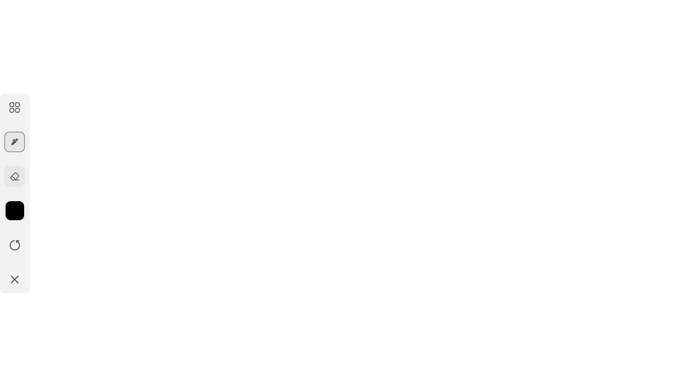
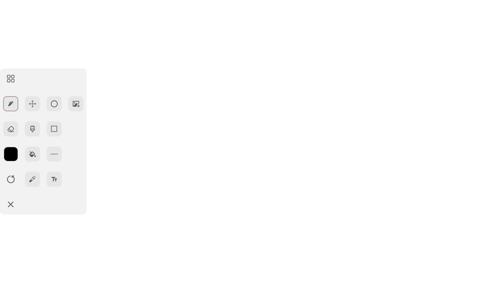
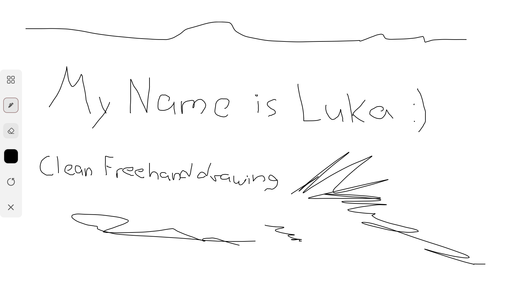
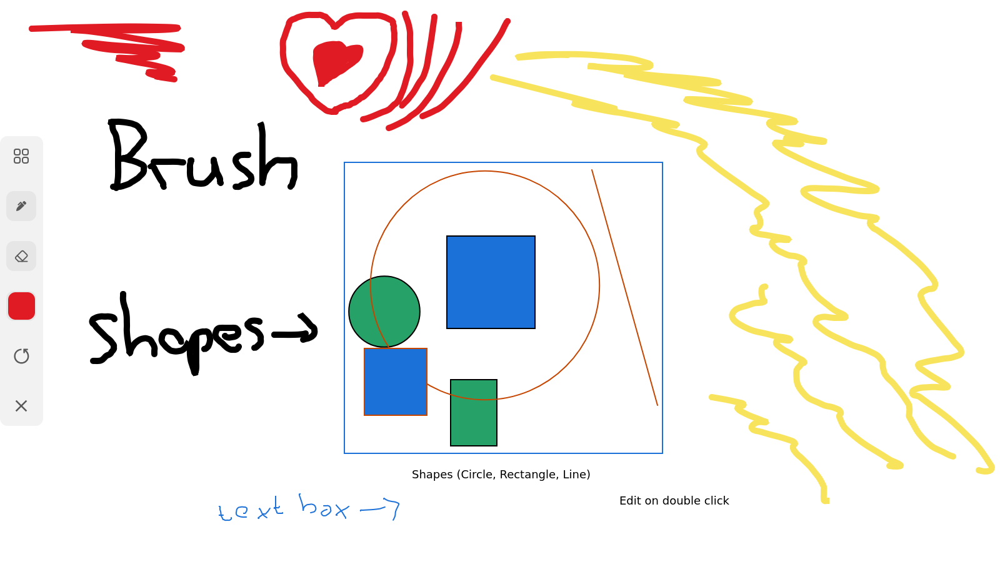
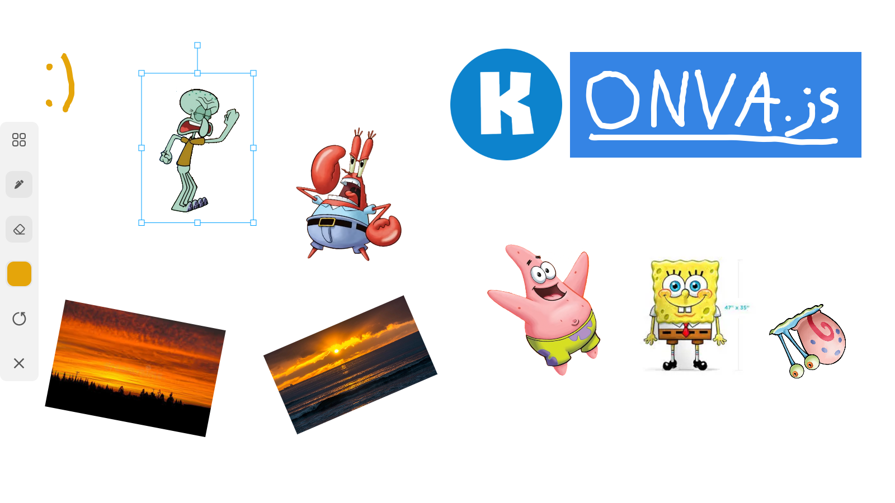

# Canvas Editor Application

This is a canvas editor application built on Konva.js library. It supports free-hand drawing, interactive shapes, images, text boxes and much more.

## Languages used
- **TypeScript**
- **HTML**
- **CSS**

## Libraries/Frameworks used
- **Konva.js**
- **React.js**
- **Tailwind CSS**

## Features
The application supprots the following functionalities:

- **Freehand drawing**

- **Insert and manipulate elements:** 
    - shapes
    - images
    - text boxes

- **Node manipulation:** 
    - drag 
    - resize 
    - rotate 
    - delete
    - change color

- **Undo/Redo**

## Prerequisites
- **npm**
- **Node.js**

## Setup
1. **Clone the github repository**:
```
https://github.com/dayzyy/CanvasEditorApp.git
```

2.  **Install the dependencies**:
```
cd CanvasEditorApp/frontend/
npm install
```
3. **Run the server**. Everything is set up now. Run the server and enjoy drawing/designing! (runs on localhost:3000 by default)

(CanvasEditorApp/frontend/)
```
npm run dev
```

## Screenshots

### Desktop







**@dayzyyiwnl**
